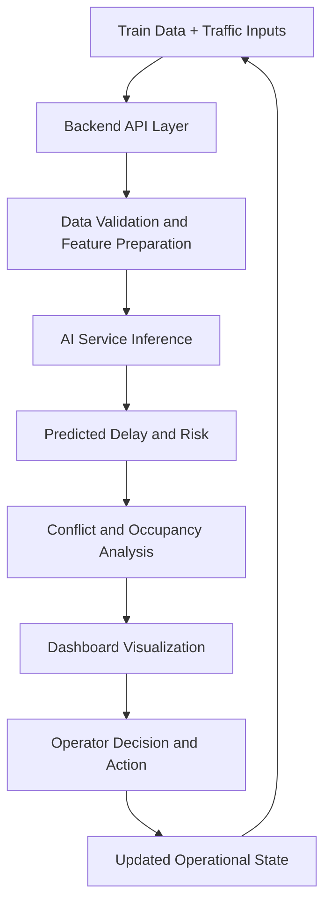

# Final Report
## AI-Based Train Traffic Control and Delay Prediction System

**Program:** B.E./B.Tech. Computer Science and Engineering (Final Year)  
**Report Type:** Project Final Report  
**Date:** April 8, 2026

---

## Abstract
This project presents an AI-Based Train Traffic Control and Delay Prediction System developed as a final-year Computer Science project. The system integrates a React frontend, Node.js/Express backend, MongoDB data layer, and a FastAPI-based AI microservice to support real-time railway traffic management. The core objective is to shift train operations from reactive handling of delays to proactive prediction and control.

The implemented platform supports train monitoring, section occupancy tracking, conflict detection, schedule and maintenance management, and AI-driven delay prediction. Machine learning models are used to estimate predicted delay, risk level, and confidence score from operational inputs such as traffic density, weather score, historical delay, and signal status. The project architecture follows a modular, service-oriented design for easier scaling and deployment.

Experimental observations show that the upgraded prediction pipeline offers practical low-latency inference and improved operational usability through actionable outputs. Beyond numeric forecasts, the system provides interpretable decision-support factors that assist control operators in real-time planning. The study demonstrates that integrating AI with modern web architecture can improve situational awareness, reduce response delay, and enhance railway traffic control efficiency.

---

## Table of Contents
1. Chapter 1: Introduction
   1.1 Title of the Seminar Topic
   1.2 Background and Importance of the Topic
   1.3 Objectives of the Seminar
   1.4 Brief Overview of Approach / Methodology
2. Chapter 3: Conceptual Study / Seminar Work
   3.1 Core Concepts Related to the Topic
   3.2 System Architecture and Model Design
   3.3 Workflow Diagram / Conceptual Framework
   3.4 Models, Algorithms, and Services Used
   3.5 Tools, Platforms, and Technologies Studied
3. Chapter 4: Results and Discussion
   4.1 Key Observations Derived from the Study
   4.2 Conceptual Comparison and Analysis
   4.3 Interpretation of Figures / Tables / Outputs
   4.4 Advantages, Limitations, and Insights
4. Chapter 5: Conclusion and Future Scope
   5.1 Summary of the Seminar Work
   5.2 Major Learning Outcomes
   5.3 Conclusions Drawn from the Study
   5.4 Future Scope and Enhancements
5. References
6. Appendix

---

## Note on Chapter Structure
As per the given instruction, this report is prepared in chapter format and **Chapter 2 (Literature Review) is intentionally skipped**.

Included chapters:
- Chapter 1: Introduction
- Chapter 3: Conceptual Study / Seminar Work
- Chapter 4: Results and Discussion
- Chapter 5: Conclusion and Future Scope

---

## Chapter 1: Introduction

### 1.1 Title of the Seminar Topic
**AI-Based Train Traffic Control and Delay Prediction System**

### 1.2 Background and Importance of the Topic
Railway traffic management is a complex real-time problem involving train scheduling, route conflicts, changing weather conditions, signal states, and operational delays. Traditional control processes are often reactive and depend heavily on manual decision-making. This may lead to congestion, cascading delays, and inefficient resource usage.

With the growth of machine learning and real-time web technologies, railway operations can be improved through predictive and data-driven control systems. In this project, an AI-enabled traffic control platform is developed to support railway operations through:
- delay prediction,
- congestion risk estimation,
- conflict detection,
- real-time monitoring,
- and operator-friendly recommendations.

The topic is important because rail transport is a critical public infrastructure. Better prediction and smarter control can improve punctuality, reduce operational cost, and enhance passenger satisfaction.

### 1.3 Objectives of the Seminar
The key objectives of this project are:
1. To design and implement an integrated train traffic control platform.
2. To develop an AI service for predicting train delay using operational features.
3. To monitor section occupancy and detect potential conflicts between trains.
4. To provide actionable recommendations to operators for better traffic flow.
5. To build a scalable full-stack architecture suitable for real-time usage.
6. To evaluate performance in terms of prediction quality, speed, and deployability.

### 1.4 Brief Overview of Approach / Methodology
The project follows a modular full-stack methodology:
1. **Frontend layer (React + Vite):** Dashboard, train management, traffic control views, analytics, and user interaction.
2. **Backend layer (Node.js + Express):** API orchestration, business logic, authentication, and integration with AI service.
3. **AI microservice (FastAPI + ML models):** Delay prediction and risk analysis based on traffic and environmental features.
4. **Database layer (MongoDB):** Storage of trains, schedules, maintenance, sections, and user data.
5. **Real-time communication (WebSocket):** Live status updates for tracking and monitoring.

The implementation uses iterative improvements, where the prediction pipeline evolved from baseline models to optimized XGBoost-driven inference for practical performance.

---

## Chapter 3: Conceptual Study / Seminar Work

### 3.1 Core Concepts Related to the Topic
The project combines software engineering, machine learning, and transportation domain concepts:
- **Traffic Density:** Represents section load and movement pressure.
- **Historical Delay:** Existing delay trend that influences future delay.
- **Signal Status:** Encoded operational state influencing train movement.
- **Weather Score:** Environmental factor affecting route reliability.
- **Congestion Risk Levels:** Categorized as Low, Medium, High, or Critical.
- **Conflict Detection:** Identification of unsafe headway or close train proximity.

The key concept is proactive control: instead of only reacting to delays, the system predicts and warns early.

### 3.2 System Architecture and Model Design
The project uses a three-tier service architecture with an AI microservice.

#### High-Level Architecture
```text
Frontend (React + Vite)
      |
      | HTTP / WebSocket
      v
Backend API (Node.js + Express)
   |            |              |
   |            |              +--> WebSocket real-time updates
   |            +--> MongoDB (operational data)
   +--> AI Service (FastAPI) --> ML Predictor (XGBoost primary, LSTM fallback)
```

#### AI Prediction Pipeline
1. Receive feature vector: traffic_density, weather_score, historical_delay, signal_status.
2. Validate and normalize request schema.
3. Run model inference (XGBoost as primary predictor).
4. Compute delay value and confidence score.
5. Assign congestion risk class.
6. Return factors and recommendation text.

### 3.3 Workflow Diagram / Conceptual Framework


This framework forms a feedback loop where decisions influence new system states and subsequent predictions.

### 3.4 Models, Algorithms, and Services Used
1. **XGBoost Regressor (Primary):**
   - Used for delay prediction.
   - Chosen for fast inference and strong accuracy on tabular traffic data.
2. **LSTM (Fallback / Supplementary):**
   - Included for sequence-aware temporal pattern handling.
   - Used as backup or hybrid support in ensemble strategy.
3. **Conflict Detection Logic:**
   - Rule-based checks for close section occupancy and timing conflicts.
4. **JWT Authentication:**
   - Secure access control for protected endpoints.
5. **REST + WebSocket Integration:**
   - REST for CRUD/data operations, WebSocket for live updates.

### 3.5 Tools, Platforms, and Technologies Studied
- **Frontend:** React, Vite, TypeScript/JavaScript, Tailwind CSS ecosystem
- **Backend:** Node.js, Express.js
- **AI Service:** Python, FastAPI, scikit-learn, XGBoost, TensorFlow/Keras (LSTM)
- **Database:** MongoDB
- **Dev/Deployment:** Docker support, modular service setup
- **Documentation and Testing:** API-level functional verification and scenario testing

---

## Chapter 4: Results and Discussion

### 4.1 Key Observations Derived from the Study
From implementation and testing, the following observations were obtained:
1. AI-assisted prediction improves early detection of potential delays.
2. XGBoost-based inference provides low-latency predictions suitable for near real-time systems.
3. Real-time dashboarding and occupancy tracking improve operator situational awareness.
4. Integrated architecture (frontend + backend + AI microservice) supports modular scaling.
5. The system can produce actionable outputs rather than only raw numeric values.

### 4.2 Conceptual Comparison and Analysis
A model upgrade path was evaluated.

| Parameter | Earlier Setup | Improved Setup |
|---|---|---|
| Primary Predictor | RandomForest / heavy stack | XGBoost-based predictor |
| Inference Speed | Higher response time | Lower latency (faster) |
| Resource Demand | Higher memory footprint | Lighter runtime footprint |
| Deployment Practicality | Moderate | Better for production use |
| Explainability Output | Basic factors | Improved recommendation output |

This indicates that the upgraded predictor stack gives better operational practicality even when balancing model complexity and speed.

### 4.3 Interpretation of Figures / Tables / Outputs
- **Delay Prediction Output:** Predicted delay in minutes helps prioritize interventions.
- **Risk Category:** A categorical risk score helps quick decision-making by dispatch/control teams.
- **Occupancy and Conflict Panels:** These visual indicators support route-level control and congestion management.
- **Performance Comparison Table:** Demonstrates a clear system-level benefit from model and architecture improvements.

### 4.4 Advantages, Limitations, and Insights

#### Advantages
1. End-to-end full-stack implementation with AI integration.
2. Practical real-time support through dashboard + WebSocket updates.
3. Faster and lighter prediction service suitable for scalable deployment.
4. Clear modular structure allows component-wise upgrades.
5. Supports both operational analytics and predictive intelligence.

#### Limitations
1. Performance depends on quality and diversity of training data.
2. Real-world railway conditions may include rare edge cases not fully represented.
3. LSTM component requires robust temporal datasets for best performance.
4. External service dependencies (network/database availability) affect reliability.

#### Insights Gained
1. In operational systems, low-latency prediction is as important as raw accuracy.
2. Hybrid architecture (rules + ML) is effective for safety-critical decision support.
3. Human-readable recommendations increase usability for non-ML operators.
4. Well-structured APIs and schema validation significantly reduce integration errors.

---

## Chapter 5: Conclusion and Future Scope

### 5.1 Summary of the Seminar Work
This project presents a complete AI-based Train Traffic Control and Delay Prediction System that combines web technologies, backend services, and machine learning. It addresses practical railway operation concerns such as delay estimation, congestion risk, and conflict visibility through an integrated platform.

### 5.2 Major Learning Outcomes
1. Understanding of real-time full-stack system design and service orchestration.
2. Hands-on experience in integrating ML models as production microservices.
3. Improved knowledge of feature-driven prediction for transportation systems.
4. Practical exposure to API security, model deployment concerns, and monitoring.
5. Experience in comparing model trade-offs: speed, complexity, and deployability.

### 5.3 Conclusions Drawn from the Study
1. AI-based decision support can significantly improve traffic management efficiency.
2. Predictive analytics enables proactive handling of delays and conflicts.
3. A modular architecture provides flexibility for iterative improvements.
4. XGBoost-centered prediction is effective for this tabular operational problem.
5. The project demonstrates technical feasibility for deployment-oriented railway support systems.

### 5.4 Future Scope and Enhancements
1. Incorporate larger real-time datasets from IoT sensors and live signaling systems.
2. Add advanced spatiotemporal models (e.g., Transformer-based forecasting).
3. Implement adaptive learning with periodic retraining and drift detection.
4. Introduce optimization engines for automatic rerouting and schedule balancing.
5. Extend to multi-zone railway networks with inter-division coordination.
6. Strengthen explainable AI modules with richer natural-language reasoning.
7. Add reliability engineering features: failover, observability dashboards, and SLA monitoring.

---

## References (Indicative)
1. Project implementation files and service modules of AI Train Traffic Control system.
2. XGBoost and scikit-learn documentation for tabular ML modeling.
3. FastAPI and Express documentation for microservice/API development.
4. Research and practice sources on railway traffic management and delay prediction.

---

## Appendix (Optional for Submission Formatting)
- API endpoint list
- Sample prediction request/response payloads
- Module-wise screenshots (dashboard, occupancy, AI output)
- Deployment configuration summary
